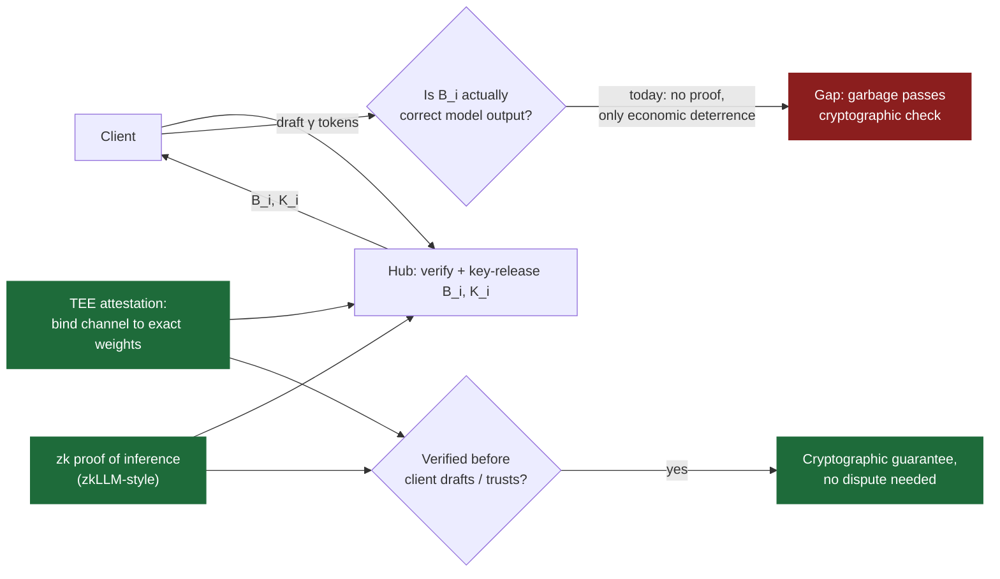
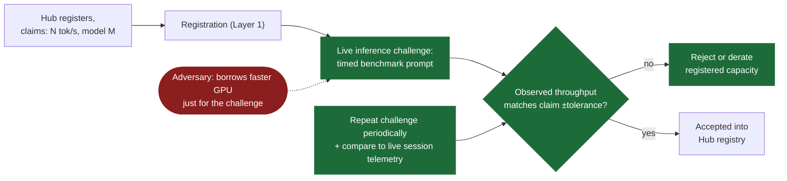
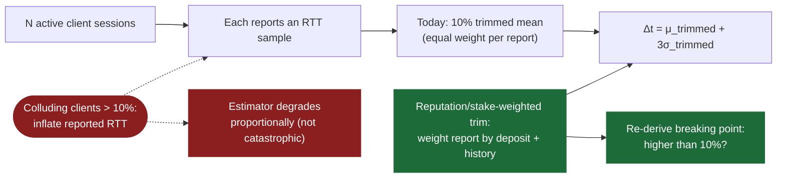
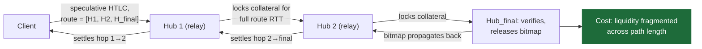
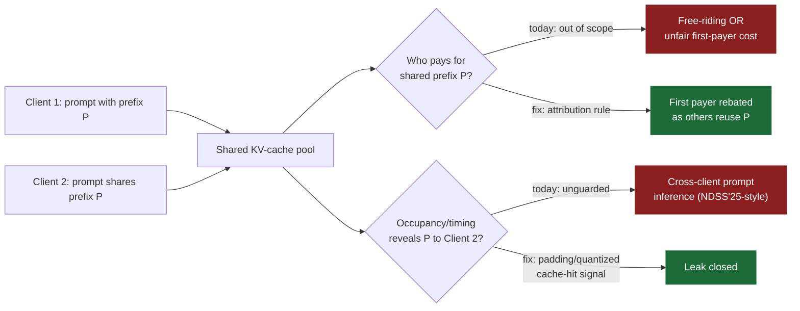
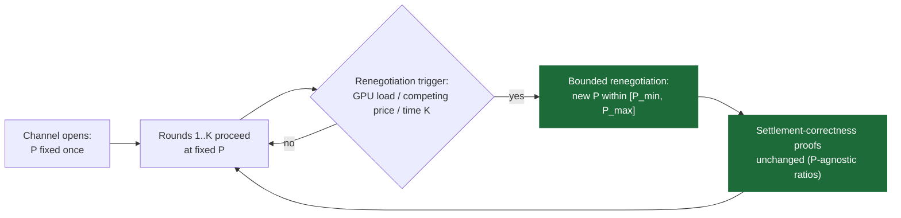
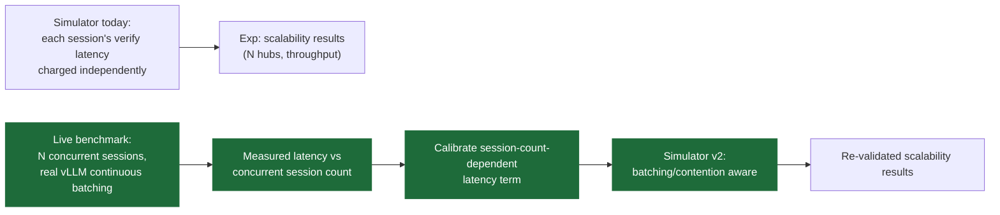

# BDLLM/SPECIE Extensions — Fixing Our Own Acknowledged Weaknesses

**Source of every idea:** these are not literature-inspired add-ons — each one closes a gap the paper *itself* already names in `07_discussion.tex` / `04_security_analysis.tex` as "future work." That's the pitch: not "a new idea near BDLLM," but "the next paper in the BDLLM series."

| # | Idea | Weakness it fixes | Paper citation |
|---|------|--------------------|-----------------|
| 1 | Verifiable Output — TEE or zk-proof of inference | Garbage generation deterred only economically, not cryptographically | §Security Analysis, "Garbage generation" |
| 2 | Live Compute Challenge at Registration | Hardware/capability claims checked only by reputation | §Security Analysis, "Capability misreport" |
| 3 | Reputation-Weighted Grace Period | Collusion defense only proven under 10% of active sessions | §Discussion, "Coordinated RTT collusion" |
| 4 | Multi-Hop Hub Routing | Client stuck with bilateral channels only — no route to unreachable Hubs | §Discussion, "Extending to multi-hop hub networks" |
| 5 | Cross-Client KV-Cache Sharing with Fair Attribution | Shared prefixes across clients are explicitly out of scope | §Discussion, "Cross-client KV-cache sharing" |
| 6 | Dynamic Price Negotiation | Price-per-token $P$ is fixed at channel open, not market-responsive | §Discussion, "Setting the price parameter in practice" |
| 7 | Multi-Session GPU Batching Calibration | Simulator charges each session's verification independently — no real batching/contention modeled | §Discussion, "What the simulator does not model" |

**Suggested pitch order for a 6-page paper:** 1 → 3 → 7 → 2 (each is a self-contained extension; 4–6 are larger/riskier, good as backups or a follow-up paper).

---

## Idea 1 — Verifiable Output: Closing the Garbage-Generation Gap

**Problem?** A Hub can key-release a technically valid but *semantically worthless* continuation. Payment atomicity (Proposition 1) is proven at the byte level, not the quality level — a cheating Hub is only deterred by an on-chain dispute *after the fact*, economically, not cryptographically.

**Solution?** Attach one of two verifiable-computation proofs to the same $(B_i, K_i)$ response, without touching the payment protocol: (a) a TEE attestation binding the channel's identity to the exact model weights in use, checked *before* the client ever drafts; or (b) a succinct proof of inference (zkLLM-style) that the verification pass actually ran on the claimed model — evaluate the current proving-cost gap against SPECIE's per-batch, sub-second budget.

**Relation to BDLLM?** This is not an add-on — the paper names this exact gap and cites zkLLM as the direction. The contribution is closing it: benchmark real proving/attestation overhead against the existing per-round latency budget your prototype already measures.

---

## Idea 2 — Live Compute Challenge at Registration

**Problem?** A Hub can overstate its hardware/throughput at registration. Today this is checked only by reputation — a Hub that under-delivers just loses future sessions, with no upfront verification.

**Solution?** Design and evaluate a live inference challenge run *at registration time*: the network issues a timed micro-benchmark prompt, measures wall-clock response, and rejects/derates any Hub whose claimed throughput doesn't match observed performance within a tolerance — closing the loop the paper's own PoC concept sketches but the current design leaves reputation-only.

**Relation to BDLLM?** The paper explicitly flags this ("a live compute challenge... would close this gap and is future work"). Your prototype already has a Proof-of-Computation stub — this extension formalizes and evaluates it as a first-class registration-time protocol step, with a threat model for a Hub that games the challenge itself (e.g., borrows a faster GPU just for the test).

---

## Idea 3 — Reputation-Weighted Grace Period (Beyond the 10% Collusion Bound)

**Problem?** Proposition 4's adaptive grace period (trimmed-mean RTT estimator) is only proven robust while colluding clients stay under 10% of a Hub's active sessions. The paper's own measurements show it degrades — not catastrophically, but not for free — once collusion exceeds that line, and explicitly leaves a stronger defense as future work.

**Solution?** Weight each client's reported RTT by an independent reputation or stake signal (e.g., channel age, historical payment compliance, deposit size) instead of treating every report as equally trustworthy input to the trimmed mean. Re-derive the collusion bound as a function of the *stake-weighted* trim, and re-run the exact CEDOS-style collusion sweep already in your simulation suite to show the new, higher breaking point.

**Relation to BDLLM?** This is a direct, named follow-up to Proposition 4 — same estimator, same experiment harness (the CEDOS honest-throughput / eviction sweep), just replacing the trim rule and re-measuring where it breaks.

---

## Idea 4 — Multi-Hop Hub Routing

**Problem?** SPECIE deliberately restricts itself to a bilateral client-to-Hub channel. A client that wants a Hub it cannot reach directly has no protocol-level path there beyond opening an entirely fresh channel.

**Solution?** Extend the payment envelope to carry a *route* of Hubs, with each hop's speculative HTLC settled only once the final Hub's verification bitmap is known — mirroring how multi-hop HTLCs compose in Lightning-style networks. The real research question (and the paper says so directly): quantify the collateral fragmentation cost — every intermediate Hub must lock capital covering the batch's max value for the *whole route's* round-trip time, not just one hop.

**Relation to BDLLM?** Directly named in Discussion as the natural extension of §Channel Design; the collateral cost trade-off is exactly the kind of thing your existing settlement/fund-conservation experiments are built to measure, just extended to N hops instead of 1.

---

## Idea 5 — Cross-Client KV-Cache Sharing with Fair Attribution

**Problem?** KV-cache blocks are shared only within one client's own session today, even when two different clients send prompts with an identical prefix — explicitly scoped out because of two unsolved problems: (a) attributing shared-prefix compute cost fairly, so the first payer doesn't subsidize every later reuser for free, and (b) preventing one client from inferring another's prompt via cache occupancy/timing (this is also the exact class of attack NDSS'25 demonstrated in general multi-tenant serving).

**Solution?** Design a cost-attribution rule (e.g., first-payer receives a rebate as later clients reuse their prefix, split proportionally) plus an occupancy-timing guard (padding/quantizing cache-hit signals) — then measure the throughput/VRAM win against BDLLM's existing per-session-only baseline, and measure whether the timing guard closes the cross-client leak.

**Relation to BDLLM?** Named verbatim in Discussion as scoped out of the current design; your scheduler (`prototype/src/hub/scheduler.py`) already implements per-session KV leasing, so this is a bounded extension of an existing module, not new infrastructure.

---

## Idea 6 — Dynamic Price Negotiation

**Problem?** Price-per-accepted-token $P$ is fixed once at channel establishment. The protocol is agnostic to the value, but the paper is explicit that a live deployment needs $P$ set from observed market rates or negotiated dynamically per session — not fixed in advance by the operator.

**Solution?** Add an in-band renegotiation step (e.g., every K rounds, or on a triggering condition like GPU load or competing Hub prices) that lets $P$ float within a bounded range without breaking the settlement-correctness proofs — since those proofs are already stated as ratios/percentages independent of $P$'s value.

**Relation to BDLLM?** The paper flags this as unresolved and, importantly, already proves the settlement-correctness results are $P$-agnostic — meaning this extension is "free" with respect to the security proofs, and the interesting new content is purely the market/negotiation mechanism and its effect on the existing cheating-Hub-economics results.

---

## Idea 7 — Multi-Session GPU Batching Calibration

**Problem?** The discrete-event simulator charges each session's verification pass its calibrated latency *independently* of every other concurrently running session on the same Hub. A real GPU batches concurrent verification passes together — which can make extra concurrent sessions *cheaper* (shared batching) or *more expensive* (compute contention) than the simulator currently predicts.

**Solution?** Run a live multi-session serving benchmark (N concurrent SPECIE sessions on one Hub, vLLM's real continuous batching) to measure the actual batching/contention curve, then calibrate a session-count-dependent latency term into the simulator — closing the gap the paper names directly as "a natural next step."

**Relation to BDLLM?** This is the most infrastructure-light of all seven ideas: it's a calibration fix to a component (`simulation/engine.py` + the calibration pipeline) that already exists and is already validated against real prototype data for the single-session case — this extends that same pipeline to the multi-session case.

---

## Why This Set Is Different From the ICNC Ideas File

The [`icnc2027_ideas.md`](../BDLLM/project%20idea/icnc2027_ideas.md) file (five ideas) borrows *attack/defense patterns from adjacent 2025–26 literature* (side channels, model substitution, DoS) and asks "what if BDLLM faced this too?" — good for novelty, but a reviewer unfamiliar with BDLLM could mistake them for generic LLM-serving-security papers.

This file instead starts from **sentences already in the SPECIE paper** that say "this is a known gap, future work" — every idea is a direct continuation of a claim you've already published, which is the stronger pitch for "extends my thesis work" framing.
