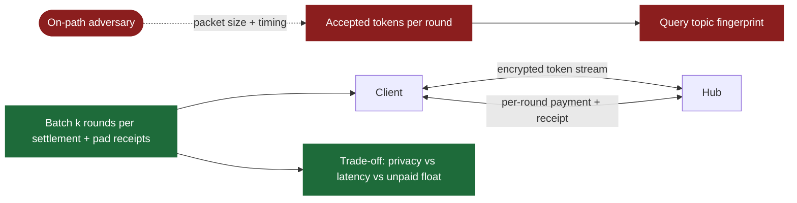
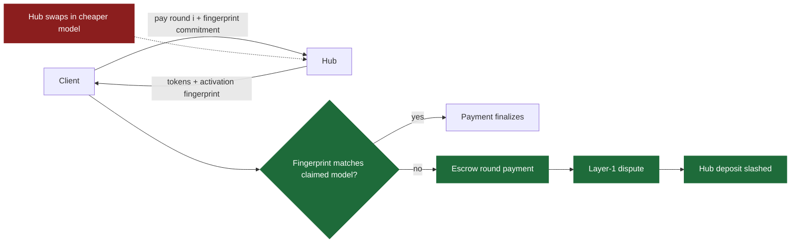
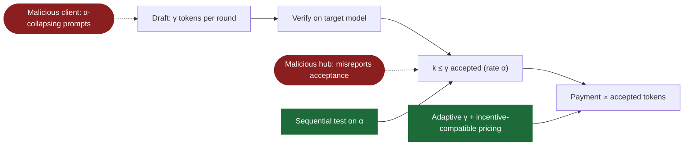
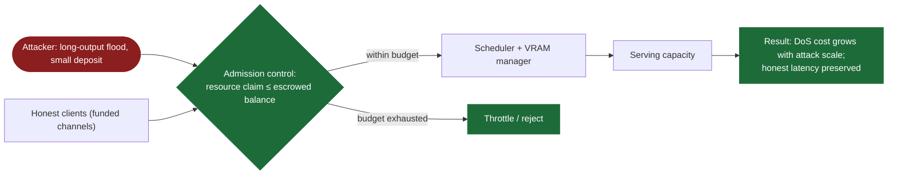
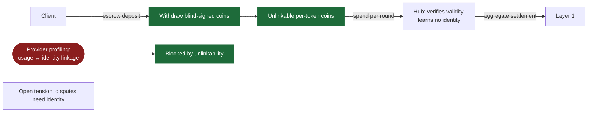

# ICNC 2027 — Five Project Ideas (BDLLM Spin-offs)

**Venue:** ICNC 2027, Honolulu, Feb 15–18 2027 · 6-page limit · best-fit track: Communications & Information Security (CIS); ideas 3–4 also fit Network Algorithms & Performance Evaluation (NAPE)

| # | Idea | One-liner | New infra needed |
|---|------|-----------|------------------|
| 1 | Metered Leakage | Payment stream is a new side channel | Almost none |
| 2 | Pay-for-what-Model | Micropayments that audit model substitution | Fingerprint + dispute game |
| 3 | Adversarial Acceptance | Manipulating α to underpay / overcharge | Almost none |
| 4 | Deposits as DoS Defense | Escrow-bounded admission control | Scheduler extension |
| 5 | Unlinkable Metering | Anonymous pay-per-token | Blind-signature layer |

**Suggested pitch order:** 1 → 3 → 4 → 2 (5 as backup).

---

## Idea 1 — Metered Leakage: The Payment Stream as a Side Channel

**Problem?** Encrypted token streams already leak query topics (Whisper Leak, NDSS/USENIX side-channel line of work). Pay-per-token adds a *second, unstudied* channel: per-round settlement messages whose size/timing encode how many tokens were accepted each round.

**Solution?** (a) Attack: fingerprint queries from payment traffic alone, even when the data channel is padded. (b) Defense: batch k rounds per settlement + pad receipts; quantify the privacy ↔ latency ↔ trust trade-off (bigger batches = more unpaid float the provider must trust).

**Relation to BDLLM?** The per-round payment protocol *is* BDLLM's core loop — attack and defense are measured directly on the existing prototype's packet traces. Smallest delta, clearly novel.

---

## Idea 2 — Pay-for-what-Model: Payment-Native Auditing of Model Substitution

**Problem?** Providers can silently swap the paid-for model for a cheaper quantized/smaller one ("Are You Getting What You Pay For?", 2025). Detection exists (activation fingerprints, rank tests) — but it has no teeth: nothing forces restitution.

**Solution?** Bind every micropayment to a lightweight commitment over the inference (activation-hash fingerprint). On suspicion, the client escrows the round's payment and opens an on-chain dispute; a cheating provider forfeits its channel deposit. Contribution = the dispute game + detection accuracy vs per-token overhead.

**Relation to BDLLM?** Reuses the channel deposit, the Layer-1 dispute path, and the cheating-hub-economics / settlement-deviation experiments as the evaluation skeleton.

---

## Idea 3 — Adversarial Acceptance: Manipulating α in Payment-Coupled Speculative Decoding

**Problem?** Mistletoe (2026) collapses draft acceptance α for pure performance harm. In a payment-coupled system α also drives *money*: pricing, γ selection, and settlement all depend on it — a strategic client or provider can game α to underpay or overcharge.

**Solution?** Model both adversaries (client crafts α-collapsing prompts; hub misreports verification results). Defend with a sequential hypothesis test on observed α, adaptive γ, and a pricing rule that is incentive-compatible under adversarial α.

**Relation to BDLLM?** Direct extension of the estimator-attack experiment and strategic-adversary simulations; the throughput-vs-α experiment and calibrated simulator already produce most of the evaluation.

---

## Idea 4 — Deposits as a DoS Defense: Economic Admission Control for LLM Serving

**Problem?** LLM-serving DoS (ThinkTrap, latency attacks on the serving framework, 2025–26) works because requests are free or flat-priced; fair schedulers account for resources but attach no cost to abuse.

**Solution?** Bound each client's in-flight resource claim (VRAM, decode slots) by its escrowed channel balance — sustained DoS becomes provably expensive. Evaluate attacker cost vs honest-client latency under burst load.

**Relation to BDLLM?** Extends the CEDOS eviction scheduler with a deposit-aware admission rule; burst-elasticity and eviction experiments are the evaluation harness.

---

## Idea 5 — Unlinkable Metering: Anonymous Pay-per-Token Inference

**Problem?** TEEs are fixing prompt confidentiality, but the payment layer still lets the provider build per-client usage profiles (who, when, how many tokens) — the exact metadata side-channel attackers want, held by the provider *by design*.

**Solution?** Blind-signature e-cash inside the channel: client withdraws unlinkable per-token coins from escrow, spends them per round; hub meters and settles aggregates on Layer 1 without linking usage to identity. Analyze the tension with disputes (Idea 2 needs identity; this hides it).

**Relation to BDLLM?** Replaces the channel's payment primitive; the crypto-microbenchmark harness supplies per-token overhead numbers.

---

## Key References

- Whisper Leak side channel — arXiv:2511.03675 · Speculative-decoding side channel — arXiv:2411.01076
- Mistletoe acceptance-collapse attack — arXiv:2605.14005
- Model-substitution auditing — arXiv:2504.04715 · Rank-based uniformity test — arXiv:2506.06975
- ThinkTrap DoS — arXiv:2512.07086 · Serving-framework latency DoS — arXiv:2602.07878 · Equinox fair scheduling — arXiv:2508.16646
- VeriLLM verifiable decentralized inference — arXiv:2509.24257
- KV-cache prompt leakage — NDSS 2025 · Confidential inference on TEEs — arXiv:2509.18886
