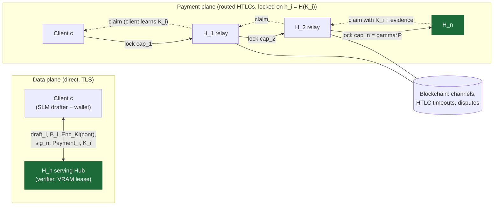
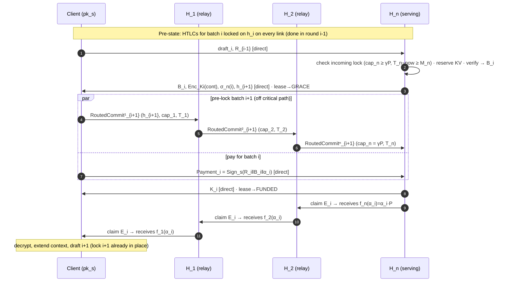
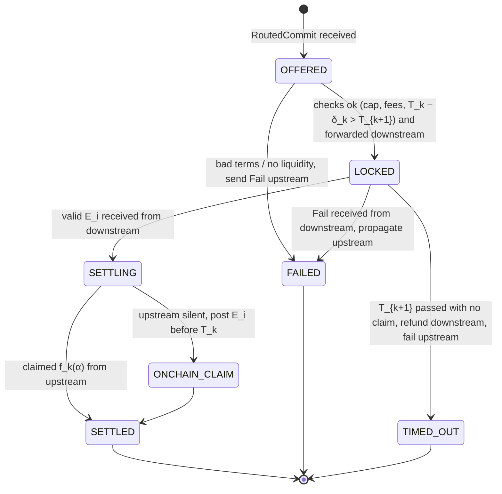

# Multi-Hop Hub Routing for SPECIE — Design Document

**Status:** design draft v0.1 · **Builds on:** Idea 4 in [`bdllm_extensions.md`](bdllm_extensions.md) · **Paper anchor:** `07_discussion.tex`, "Extending to multi-hop hub networks"

> *"...a client's payment envelope could carry a route of Hubs rather than a single verifier, with each hop's speculative HTLC settled only once the final Hub's bitmap is known ... The practical cost is collateral: every intermediate Hub would need to lock capital covering the batch's maximum value for the round-trip time of the whole route, not just one hop, fragmenting liquidity across the network in proportion to path length."* — SPECIE, §Discussion

**One-paragraph summary.** We extend SPECIE's bilateral speculative state channel into a *routed* one. The client keeps a single funded channel with some Hub $H_1$ and buys verification from a distant Hub $H_n$ through a path of Hub-to-Hub channels. The design rests on three moves. (1) **Split the planes:** drafts, bitmaps and ciphertext travel directly between client and $H_n$, and only payments travel over the route. (2) **The key is the preimage:** every hop's HTLC is locked on $H(K_i)$, the key commitment SPECIE already has $H_n$ sign. Getting paid therefore requires revealing the decryption key, so the goods and the money propagate back along the path atomically. (3) **Bitmap-determined amounts at every hop:** each hop's amount is a public function $f_k(\alpha_i)$ of the one bitmap $B_i$ that $H_n$ signed and the client approved. With one-batch-ahead lock pipelining, routing adds no round-trips to the per-round critical path. Its whole cost is collateral. We model that collateral exactly, and show it grows linearly with path length in the honest case but *quadratically* under adversarial stalling. That quadratic term is the result the paper's one-sentence remark does not capture.

---

## 1. Problem and Motivation

SPECIE today: one client, one Hub, one channel $Ch = (c_i, h_j, d, P, \gamma, R_0)$ opened on-chain. If a client wants a *different* Hub (a different target model, cheaper $P$, lower RTT, or spare capacity when its usual Hub is full), it must:

1. submit an on-chain open (latency $D_{L1}$, a transaction fee),
2. lock a **second** deposit $d' \ge S_{\min}$ for the new Hub,
3. submit an on-chain close later (a second fee).

For short sessions, which is most chat-style inference, this fixed cost dominates. A client may want to try several Hubs in one hour, and it pays $2$ transactions and $S_{\min}$ of idle capital for each.

**What routing buys:** open one channel once, and reach *any* Hub connected to the Hub graph. **What it costs:** every intermediate Hub pins its own liquidity for every in-flight batch. The research question is how much, and under what conditions routing still beats opening a fresh channel.

**Motivating scenarios (use one in the paper intro):**

| Scenario | Why the client can't use $H_1$ | Why not open a channel to $H_n$ |
|---|---|---|
| Model diversity | $H_1$ serves Llama-70B; task needs a code model at $H_n$ | One-off query, and the deposit plus 2 tx costs more than the query |
| Capacity overflow | $H_1$ is at $N_{\max}$ admission cap, so the client is queued | Burst lasts minutes; the channel outlives it |
| Geography | $H_1$ is 180 ms away; $H_n$ is 2 ms away | Traveling user, short-lived need |

---

## 2. Scope, Goals, Research Questions

**Goals (must hold end to end across the route):**

- **G1 Route atomicity.** The client is charged for batch $i$ iff it can decrypt batch $i$'s continuation, and every hop's charge is derived from the same verified bitmap.
- **G2 Relay safety.** An honest relay never loses principal; its worst case is locked capital (time value) and a missed fee.
- **G3 Bounded exposure.** Per-party exposure bounds of the form of SPECIE's Proposition 2 still hold, with fees added.
- **G4 Liquidity liveness.** A non-paying client cannot pin route collateral longer than $\Delta t$ plus propagation. Only a *stalling Hub* can pin it longer, and that stall is attributable.
- **G5 No critical-path penalty.** Per-round latency matches single-hop SPECIE when pipelining is on.

**Non-goals (v1):** path-finding optimality (we use simple source routing), strong route privacy (onion routing is optional, and hash correlation is a known leak; see §8), cross-client KV sharing, dynamic pricing (Idea 6), and multi-path splitting of one batch.

**Research questions:**

| RQ | Question | Primary metric |
|---|---|---|
| RQ1 | How does locked collateral scale with path length $n$, honest vs adversarial? | Capital-time per accepted token; amplification $A(n)$ |
| RQ2 | Does lock pipelining remove routing's latency overhead? | Per-round latency, TTFT, TPOT vs $n$ |
| RQ3 | When does routing beat opening a fresh channel? | Break-even session length $M^*$ |
| RQ4 | How much honest throughput survives liquidity jamming? | Honest routed throughput vs attacker budget |
| RQ5 | Is money conserved across hops, per round, on the live chain? | Per-hop settlement deviation (should be 0) |
| RQ6 | Does routing shift the optimal draft length $\gamma^*$? | $\gamma^*$ single-hop vs routed |

RQ6 is a testable hypothesis the cost model predicts (§7.5): collateral per accepted token grows with $\gamma$, so routing should push $\gamma^*$ *down*.

---

## 3. System Model Changes

### 3.1 Network model

Keep all SPECIE entities. Add:

- **Hub-to-Hub channels.** Two registered Hubs open a *dual-funded* bilateral channel $Ch^{H}=(h_a, h_b, d_a, d_b)$. Either side can forward conditional payments to the other. The existing chaincode `OpenChannel(id, userID, providerID, userDeposit, providerDeposit)` already takes two deposits; it needs generalizing so both parties can be providers.
- **Hub graph** $G=(\mathcal{H}, E)$: vertices are registered Hubs, edges are open Hub-to-Hub channels, and each edge carries its current directional liquidity $\Lambda_{a\to b}$.
- **Roles on a route** $\pi = (c, H_1, \dots, H_n)$:
  - **Payer:** client $c$, with a normal SPECIE channel to $H_1$.
  - **Relays:** $H_1, \dots, H_{n-1}$. They forward payments, hold **no VRAM** for this session, and run no inference for it.
  - **Serving Hub:** $H_n$. It runs verification, holds the KV lease, and samples keys.
  - Link $k$ is the channel from $H_{k-1}$ to $H_k$, with $H_0 \equiv c$, so a route has $n$ links. $n=1$ is exactly today's SPECIE.

**Planes.** The client talks to $H_n$ **directly** over TLS for drafts, bitmaps, ciphertext and `Payment_i` (the *data plane*). Only conditional payments traverse $\pi$ (the *payment plane*). "Cannot reach directly" in the paper means *has no channel with*, not *has no network path to*. The variant where there is also no network path is in §11.

### 3.2 Threat model changes

Everything in the SPECIE model carries over. Changes:

- The adversary may corrupt **any subset** of route nodes, including several relays that collude, and the client together with $H_n$. The single-hop rule "never both endpoints of the same channel" is kept **per link**. Guarantees are stated per honest party. Whatever the others do, an honest relay must not lose principal (G2).
- **New adversary goals:**
  - *Liquidity jamming:* pin relay capital without paying.
  - *Stalling:* hold an incoming HTLC unresolved.
  - *Wormhole:* two colluding relays skip an honest relay between them and take its fee.
  - *Route surveillance:* relays infer per-round acceptance $\alpha_i$ from amounts.
- The blockchain still finalizes within $D_{L1}$. Timelock safety (§5.6) is stated in terms of $D_{L1}$, so it is chain-agnostic.

---

## 4. Design Overview

**Key design decisions and why:**

| # | Decision | Alternative rejected | Reason |
|---|---|---|---|
| D1 | Data plane direct to $H_n$ | Relay drafts through the path | Relaying drafts adds $n$ hops per round and exposes prompts to every relay |
| D2 | Lock HTLCs on $h_i = H(K_i)$ ("key as preimage") | Lock on the client's chain preimage $R_i$ | The client knows every $R_i$ from setup, so it could claim or unlock itself. $K_i$ is known only to $H_n$, and revealing it *is* delivery. This makes key withholding self-defeating (§8) |
| D3 | $H_n$ pre-commits $h_{i+1}$ in round $i$'s response | Lock after verification | The payment hash must exist before the lock. Pre-commitment lets locks travel ahead of the draft |
| D4 | Pipeline depth $w$ (default 1): locks for batch $i{+}w$ travel while batch $i$ runs | Lock-then-draft serially | Takes the forward lock latency off the critical path (G5) at the cost of $w$ extra caps of collateral |
| D5 | Hop amount $f_k(\alpha)$, a public function of one signed bitmap | Per-hop renegotiation | No reconciliation round-trip. Every hop computes the same number |
| D6 | Keep the client's hash chain $R_i$ end to end, between client and $H_n$ only | Drop it | `Payment_i` and $H_n$'s lease logic stay byte-for-byte as in SPECIE; chain-skipping protection (Prop. 3) still holds |
| D7 | EXPIRED lease at $H_n$ triggers `fail` backward | Wait for timelocks | Frees the whole route's collateral within $\Delta t$ of a non-paying client, not in seconds or minutes (G4) |

---

## 5. Protocol

### 5.1 Notation (additions to SPECIE's Table)

| Symbol | Meaning |
|---|---|
| $\pi=(c,H_1,\dots,H_n)$ | route. Link $k$ is $H_{k-1}\to H_k$ with $H_0=c$ |
| $rid$ | route/session identifier (random, chosen by the client) |
| $pk_s$ | client's ephemeral **session** key. $H_n$ and relays never learn the client's on-chain identity |
| $h_i = H(K_i)$ | key commitment for batch $i$; the HTLC payment hash |
| $\sigma_n(i)$ | $\mathrm{Sign}_{H_n}(rid \,\|\, i \,\|\, B_i \,\|\, h_i)$, the serving Hub's signed bitmap |
| $\mathrm{Payment}_i$ | $\mathrm{Sign}_{s}(R_i \,\|\, B_i \,\|\, \alpha_i)$, unchanged from SPECIE except signed with $pk_s$ |
| $E_i$ | claim evidence $(K_i, B_i, \sigma_n(i), R_i, \mathrm{Payment}_i)$ |
| $f_k(\alpha)$ | amount on link $k$ when $\alpha$ tokens are accepted (§6) |
| $\mathrm{cap}_k = f_k(\gamma)$ | max value locked on link $k$ per batch |
| $b_k, r_k$ | relay $H_k$'s base fee and proportional fee rate |
| $T_k$ | absolute expiry of link $k$'s HTLC |
| $\delta_k = T_k - T_{k+1}$ | per-hop timelock delta |
| $w$ | lock pipeline depth (outstanding pre-locked batches) |
| $M_n$ | serving Hub's minimum remaining-expiry margin |

### 5.2 Setup

1. **Registration** is unchanged. Hubs additionally open Hub-to-Hub channels and advertise $(b_k, r_k, \delta_k, \Lambda)$ per edge in the registry.
2. **Discovery and path selection.** The client picks $H_n$ from the registry and computes a path in $G$ from its own Hub $H_1$ to $H_n$. It minimizes

   $$\mathrm{cost}(\pi) = \sum_k \mathrm{fee}_k(\bar\alpha) + \lambda \sum_k \mathrm{cap}_k\,\tau_k,$$

   subject to $\Lambda_{k-1\to k} \ge (w+1)\,\mathrm{cap}_k$ on every edge. The second term prices collateral explicitly (§7). The client routes over its own view (source routing), with Dijkstra on this additive cost. Capacity-aware dynamic routing (e.g., *Flash*) is related work, not a contribution here.
3. **Session handshake (data plane, direct $c \leftrightarrow H_n$).** This is SPECIE's `HandshakeRequest/Accept`, extended: agree $P, \gamma, L_{\max}$; $H_n$ reports $\Delta t$ and $M_n$; the client sends $pk_s$ and $R_0$; $H_n$ sends $h_1, \dots, h_w$ (the first $w$ key commitments) and learns $rid$. **No on-chain transaction occurs.**
4. **Route open (payment plane).** The client sends a `RouteOpen` hop by hop, optionally as an onion so each relay sees only its neighbours. Relay $H_k$ receives $(rid, \text{next hop}, \mathrm{cap}_{k+1}, \text{fee terms}, \delta_k, pk_s, pk_{H_n})$. It needs $pk_s$ and $pk_{H_n}$ to validate claim evidence later. Each relay checks its fee and delta match what it advertised, reserves the HTLC slot, and acks. Route open costs one path round-trip, **once per session**.

### 5.3 Routed conditional envelope

On link $k$, sender $H_{k-1}$ offers:

$$\mathrm{RoutedCommit}^k_i = \mathrm{Sign}_{H_{k-1}}\bigl(rid \,\|\, i \,\|\, h_i \,\|\, \mathrm{cap}_k \,\|\, \phi_k \,\|\, T_k\bigr)$$

Here $\phi_k$ encodes the fee terms downstream of link $k$, so $f_k(\cdot)$ can be computed. For $k=n$ this plays the role of SPECIE's $\mathrm{SpeculativeCommit}_i$: it promises at most $\gamma P$, the amount is fixed later by the bitmap, and $H_n$ never verifies a batch without it.

**Claim rule (checked identically by every hop and by the chain).** $H_k$ can claim $a_k = \min(\mathrm{cap}_k, f_k(\alpha))$ from $H_{k-1}$ by presenting $E_i$ before $T_k$, where:

1. $H(K_i) = h_i$,
2. $\sigma_n(i)$ verifies under $pk_{H_n}$ over $(rid, i, B_i, h_i)$,
3. $\mathrm{Payment}_i$ verifies under $pk_s$ over $(R_i, B_i, \alpha)$, and
4. $\alpha = \mathrm{popcount}(B_i)$.

Checks 2 and 3 together mean that **both** the Hub that did the work and the client that received it agreed on $B_i$. Relays never need the client's hash chain; $H_n$ alone checks $H(R_i)=R_{i-1}$.

**Fail rule.** Before $T_k$, $H_k$ may send $\mathrm{Fail}^k_i=\mathrm{Sign}_{H_k}(rid \,\|\, i \,\|\, \texttt{fail} \,\|\, \text{reason})$ to $H_{k-1}$. The HTLC is removed and nothing moves. After $T_k$, $H_{k-1}$ can reclaim unilaterally (off-chain by mutual update, or on-chain).

Each add, settle or fail on a link is a checkpoint update with a revocation secret, exactly SPECIE's §Dispute mechanism. Per-link settlement integrity (Props. 3–4) is inherited unchanged.

### 5.4 Streaming round $i$ (steady state, $w=1$)

Precondition: link-$k$ HTLCs for batch $i$, locked on $h_i$, are already in place for all $k$. They were created during round $i-1$.

1. **Draft.** The client drafts $\gamma$ tokens and sends $(rid, i, \text{draft}, R_{i-1})$ **directly** to $H_n$.
2. **Admission check.** $H_n$ checks that it holds an incoming link-$n$ HTLC for $(rid, i, h_i)$ with $\mathrm{cap}_n \ge \gamma P$ and $T_n - \mathrm{now} \ge M_n$. If not, it waits, or rejects if the wait exceeds a bound.
3. **Reserve + verify.** As in SPECIE: lease KV blocks (pending), one forward pass, producing $B_i$ and $\alpha_i$.
4. **Key-wrap + pre-commit.** $H_n$ encrypts the continuation under the $K_i$ it pre-committed as $h_i$, and returns $(B_i, \mathrm{Enc}_{K_i}(\cdot), \sigma_n(i), h_{i+1})$. The lease goes to GRACE and the timer $\Delta t$ starts.
5. **Pre-lock next batch (off the critical path).** On receiving $h_{i+1}$, the client immediately offers link-1 $\mathrm{RoutedCommit}^1_{i+1}$ and it propagates forward to $H_n$. This overlaps steps 6–8 and the drafting of batch $i{+}1$.
6. **Pay.** The client checks $B_i$ against its draft, then sends $\mathrm{Payment}_i=\mathrm{Sign}_s(R_i\|B_i\|\alpha_i)$ **directly** to $H_n$. This is the message SPECIE uses, byte for byte.
7. **Settle at $H_n$ + key release.** $H_n$ checks $H(R_i)=R_{i-1}$, the signature, and that the bitmap matches (SPECIE's three checks). It then:
   - (a) claims from $H_{n-1}$ by sending $E_i$, and
   - (b) sends $K_i$ directly to the client, so the client does not wait for the backward claim chain.

   Sending $K_i$ directly is safe for everyone. $H_n$ has already revealed $K_i$ to claim, and the client's link-1 HTLC is still claimable by $H_1$ once $H_1$ learns $E_i$. The lease returns to FUNDED.
8. **Backward claim cascade.** Each relay $H_k$, on receiving $E_i$ from $H_{k+1}$, validates it (§5.3), settles its outgoing link, and claims from $H_{k-1}$ with the same $E_i$. The cascade ends when $H_1$ claims $f_1(\alpha_i)$ from the client.
9. **Continue.** The client verifies $H(K_i)=h_i$, decrypts, extends its context, and drafts batch $i{+}1$. The lock for $i{+}1$ is usually already in place.

**Critical path per round:** draft → direct one-way → verify → direct one-way → pay (direct one-way) → key (direct one-way). This is the **same sequence of messages as single-hop SPECIE**. Routing adds work to the critical path only if the forward lock for $i{+}1$ arrives at $H_n$ after draft $i{+}1$ does, i.e. if

$$\sum_{k=1}^{n} ow^{\text{pay}}_k \;>\; ow^{\text{direct}}_{H_n\to c}(K_i) + t_{\text{draft}} + ow^{\text{direct}}_{c\to H_n}.$$

Hub-to-Hub links are usually datacenter links (2–90 ms in the simulator's RTT matrix), and $t_{\text{draft}}$ is tens to hundreds of ms, so $w=1$ should almost always hide the lock. RQ2 measures where it stops doing so.

### 5.5 Failure paths

| Event | Detected by | Action | Collateral freed after |
|---|---|---|---|
| Client never sends `Payment_i` | $H_n$ lease GRACE → EXPIRED at $\Delta t$ | $H_n$ evicts KV (as in SPECIE) **and** sends $\mathrm{Fail}^n_i$. Each relay fails upstream on receiving a fail | $\Delta t + \sum_k ow^{\text{pay}}_k$ |
| Client stops drafting (pre-locks unused) | $H_n$: lock for $i{+}w$ idle past its margin | $H_n$ fails the unused locks | $\approx M_n$ |
| $H_n$ never responds to a draft | Client, after timeout | Client sends nothing more; $H_n$ never gets $\mathrm{Payment}_i$, so it cannot build $E_i$ and cannot claim | Honest relays: at $T_k$, unless $H_n$ fails politely |
| $H_n$ gets `Payment_i` but withholds $K_i$ | Client | Nothing to do: without revealing $K_i$, $H_n$ cannot claim, and every HTLC refunds at $T_k$ | $T_k$ (stall, attributable to $H_n$) |
| Relay $H_k$ stalls (neither claims nor fails) | $H_{k-1}$ | Wait for $T_k$. If $H_k$ later claims on-chain, $H_{k-1}$ learns $E_i$ from the chain and claims upstream within $\delta_{k-1}$ | $T_k$ for link $k$ and every link upstream |
| Upstream $H_{k-1}$ offline when $H_k$ claims | $H_k$ | Claim on-chain with $E_i$ before $T_k$; $E_i$ becomes public | $\le T_k$ |
| $H_n$ equivocates (two $B_i$ for the same $(rid,i,h_i)$) | Anyone who sees both | Two signed tuples are non-repudiable, so $H_n$'s stake is slashed (as in SPECIE) | n/a |

### 5.6 Timelock derivation

Chain-enforced timelocks must let every honest hop claim upstream after downstream has claimed from it.

- **Final hop margin.** $H_n$ must be able to get an on-chain claim included after receiving `Payment_i`, so it only activates (verifies) a batch whose lock satisfies $T_n - \mathrm{now} \ge M_n$, where

  $$M_n = \Delta t + D_{L1} + \varepsilon.$$

- **Client's choice of $T_n$.** The lock is created about $w$ rounds before it is used, so the client sets $T_n = t_{\text{create}} + E_{\text{pipe}} + M_n$, where $E_{\text{pipe}} \approx w\,\bar T_{\text{round}}$. If the client is slower than that, the lock goes stale: $H_n$ fails it and the client re-locks.
- **Per-hop delta.** If $H_{k+1}$ claims on-chain at the last moment $T_{k+1}$, then $E_i$ is public at $T_{k+1}$. $H_k$ must get its own claim included by $T_k$, so

  $$\delta_k = T_k - T_{k+1} \ge D_{L1} + \varepsilon_k,$$

  where $\varepsilon_k$ covers the relay's chain-monitoring latency.
- **Resulting ladder:**

  $$T_k = T_n + \sum_{j=k}^{n-1}\delta_j \;\approx\; t_{\text{create}} + E_{\text{pipe}} + M_n + (n-k)\,\delta.$$

This is the same structure as Lightning's `cltv_expiry_delta`, with one quantitative difference: SPECIE's prototype chain (Hyperledger Fabric) finalizes in seconds, while Lightning deltas are tens of Bitcoin blocks per hop (hours). **Worst-case lock times here are seconds, not hours.** Stating this sharply in the paper is worthwhile. The model below is written in $D_{L1}$ so it covers both kinds of chain.

### 5.7 State machines

Relay HTLC, one per $(rid, i)$ per link:

The serving Hub's lease states (FUNDED / GRACE / EXPIRED) are **unchanged**, with three additions: admission into verification requires an incoming LOCKED HTLC (step 2); GRACE → FUNDED fires on `Payment_i` *and* is followed by the claim; GRACE → EXPIRED also emits $\mathrm{Fail}^n_i$ (decision D7). This keeps the change to `hub/scheduler.py` to a single hook.

---

## 6. Amounts, Fees, and Conservation

**Hop amount function.** Define it downstream-first:

$$f_n(\alpha) = \alpha P, \qquad f_k(\alpha) = f_{k+1}(\alpha) + \underbrace{b_{k} + r_{k}\,f_{k+1}(\alpha)}_{\mathrm{fee}_{k}(\alpha)}, \quad k = n-1,\dots,1.$$

Here $\mathrm{fee}_k$ is relay $H_k$'s fee on the amount it forwards. The client pays $f_1(\alpha)$ on link 1 to $H_1$. Caps: $\mathrm{cap}_k = f_k(\gamma)$, so

$$\mathrm{cap}_1 \approx \gamma P \prod_{j<n}(1+r_j) + \sum_{j<n} b_j.$$

**Conservation invariant (per batch $i$, checked in RQ5):**

$$\underbrace{f_1(\alpha_i)}_{\text{client debit}} \;-\; \underbrace{\alpha_i P}_{H_n\text{ credit}} \;=\; \sum_{k=1}^{n-1}\mathrm{fee}_k(\alpha_i), \qquad \text{relay }H_k\text{ nets } f_k(\alpha_i) - f_{k+1}(\alpha_i) = \mathrm{fee}_k(\alpha_i).$$

This is the direct $n$-hop generalization of the existing fund-conservation experiment (4.2), which checks client-spent = hub-settled = $\sum \alpha P$.

**Fee design choices (to decide; recommendation first):**

1. **Base fee settles even when $\alpha=0$ (recommended).** Relays locked $\mathrm{cap}_k$ whatever the outcome, so a pure proportional fee would pay them nothing for rejected batches, and at low acceptance rates relaying would be unprofitable. Base fees are paid only on a *claimed* batch, never on a failed one.
2. **Optional upfront fee** (a small unconditional amount per offered HTLC) to price stalling and jamming, as discussed for Lightning. Leave it off in v1; include it as an ablation in RQ4.
3. **Rational fee floor.** With per-second cost of capital $\rho_k$ and honest lock time $\tau_k$ (§7), a relay forwards only if

   $$\mathbb{E}[\mathrm{fee}_k(\alpha)] \ge \rho_k\,\mathrm{cap}_k\,\tau_k + \pi_k,$$

   where $\pi_k$ is a risk premium for adversarial lock time. This is how the collateral cost becomes a price the client sees.

---

## 7. Collateral Cost Model (the core research contribution)

The paper's claim is that liquidity fragments "in proportion to path length." We make that precise and show where it is **wrong**: in the adversarial case the growth is quadratic.

### 7.1 Honest lock time per link

Let $\tau_n$ be the time the link-$n$ HTLC is locked in the honest case:

$$\tau_n \approx \underbrace{E_{\text{pipe}}}_{\text{waits for its batch}} + t_{\text{verify}} + RTT^{\text{direct}}_{c,H_n} + t_{\text{claim}}.$$

Upstream links are created earlier (forward propagation) and settled later (backward cascade), so

$$\tau_k \approx \tau_n + RTT^{\text{pay}}_{k\to n},$$

where $RTT^{\text{pay}}_{k\to n}$ is the Hub-path round-trip from $H_k$ to $H_n$.

### 7.2 Locked capital via Little's law

One batch per round per session means HTLCs arrive on link $k$ at rate $1/\bar T_{\text{round}}$ and each stays for $\tau_k$. By Little's law, the **average capital locked on link $k$ per session** is

$$\bar L_k = \mathrm{cap}_k \cdot \frac{\tau_k}{\bar T_{\text{round}}} \;\approx\; \mathrm{cap}_k\,(w + \theta_k), \qquad \theta_k = \frac{\tau_k - E_{\text{pipe}}}{\bar T_{\text{round}}} \approx 1.$$

**Headline result 1:** every routed session pins about $(w{+}1)$ batch caps of liquidity **at every link**. A relay with liquidity $\Lambda$ on an outgoing edge can therefore carry at most

$$N_k^{\max} \approx \frac{\Lambda}{(w+1)\,\mathrm{cap}_k}$$

concurrent routed sessions. This is the relay's analogue of the serving Hub's $N_{\max}$ VRAM cap: liquidity is the relay's scarce resource, as VRAM is the serving Hub's.

### 7.3 Capital-time per round, and the amplification factor

Honest capital-time locked across the whole route for one batch is $\mathcal{C}^{\text{hon}}(n) = \sum_{k=1}^n \mathrm{cap}_k\,\tau_k$. Relative to single-hop SPECIE ($n=1$, where the only lock is the client's envelope for about $\tau_n$):

$$A^{\text{hon}}(n) = \frac{\sum_k \mathrm{cap}_k \tau_k}{\gamma P\,\tau_n} \;\approx\; n + \frac{\sum_k RTT^{\text{pay}}_{k\to n}}{\tau_n} \quad(\text{fees}\ll \gamma P).$$

This is **linear in $n$**, since Hub-to-Hub RTTs are small relative to $\tau_n$. It confirms the paper's intuition for honest traffic.

**Adversarial case (stall).** A stalling node pins each upstream link until its timelock:

$$\mathcal{C}^{\text{adv}}(n) = \sum_{k=1}^n \mathrm{cap}_k\,(T_k - t_{\text{create},k}) \;\approx\; \gamma P\Bigl[n\,(E_{\text{pipe}}+M_n) + \delta\,\frac{n(n-1)}{2}\Bigr],$$

$$A^{\text{adv}}(n) = n + \frac{\delta\, n(n-1)}{2\,(E_{\text{pipe}}+M_n)}.$$

**Headline result 2: adversarial collateral grows as $\Theta(n^2)$.** The quadratic term is set by $\delta \ge D_{L1}$, i.e. by chain finality, not by network RTT. A client-only attacker *cannot* trigger it: decision D7 caps a non-paying client at $\Delta t$ plus propagation, which is the linear case. Only a stalling **Hub** on the route can, and its stall is attributable (§8).

### 7.4 Worked example (illustrative numbers; replace with calibrated values)

The inputs below are **assumptions** for shape, not measurements. Replace $\bar T_{\text{round}}$, $t_{\text{verify}}$ and $\Delta t$ with the prototype's calibrated values before quoting anything.

Assumed: $\bar T_{\text{round}} = 0.5$ s, $w=1$ so $E_{\text{pipe}}=0.5$ s, $\Delta t = 0.5$ s, $\tau_n \approx 0.6$ s, Hub-path RTTs 2–90 ms (from `simulation/models/network.py`).

| Chain | $D_{L1}$ | $\delta$ | $M_n$ | $A^{\text{hon}}(3)$ | $A^{\text{adv}}(3)$ | $A^{\text{adv}}(5)$ | worst-case lock on link 1, $n{=}5$ |
|---|---|---|---|---|---|---|---|
| Fabric-like (fast finality) | 2 s | 2.5 s | 3 s | ≈ 3.0–3.5 | ≈ 5.1 | ≈ 12.1 | ≈ 13.5 s |
| Ethereum-L1-like (≈13 min finality) | 780 s | 781 s | 781 s | ≈ 3.0–3.5 | ≈ 6.0 | ≈ 15.0 | ≈ 65 min |

Takeaways to test:

- Honest amplification is about $n$ and does not depend on the chain.
- Adversarial amplification has the same *shape* on both chains, but its absolute pin time scales with $D_{L1}$.
- Routing is practical on fast-finality chains and questionable on slow ones unless there is an upfront fee.

### 7.5 Interaction with the draft length $\gamma$ (RQ6)

Collateral per accepted token is proportional to $\mathrm{cap}/\mathbb{E}[\alpha(\gamma)] \propto \gamma / \mathbb{E}[\alpha(\gamma)]$. Acceptance saturates as $\gamma$ grows, so this ratio increases with $\gamma$. A router that prices collateral (§6.3) therefore adds a cost term increasing in $\gamma$ to SPECIE's throughput objective, which **should move $\gamma^*$ below the single-hop optimum** (1.39× speedup at the paper's measured optimum). This falls out of the existing $\gamma$-sweep harness.

### 7.6 Break-even against opening a fresh channel (RQ3)

Opening a direct channel costs 2 on-chain transactions ($2g$), $D_{L1}$ of extra time-to-first-token, and $S_{\min}$ of the client's capital idle for the session. Routing costs about $\sum_k \mathrm{fee}_k(\bar\alpha)$ per batch. Ignoring the capital term, routing wins for sessions shorter than

$$M^* \approx \frac{2g + \rho_c S_{\min} T_{\text{sess}}}{\sum_{k<n} \mathrm{fee}_k(\bar\alpha)}\quad\text{batches}.$$

Report $M^*$ as a function of $n$ and of chain fee $g$, and mark where typical chat-length sessions (a few hundred tokens, i.e. tens of batches) fall.

---

## 8. Security Analysis (propositions to prove, sketches included)

Guarantees are stated per honest party, under SPECIE's assumptions: unforgeable signatures, a collision-resistant $H$, and a chain that finalizes within $D_{L1}$.

**Proposition R1 (Route atomicity).** *For every batch $i$, the client is charged on link 1 only if $K_i$ with $H(K_i)=h_i$ is revealed to it, and every link's charge equals $f_k(\alpha_i)$ for one bitmap $B_i$ signed by both $H_n$ and the client.*

Sketch: The link-1 claim rule requires $E_i$, which contains $K_i$. Every link validates the same $\sigma_n(i)$ and $\mathrm{Payment}_i$ over the same $(rid,i,B_i,h_i)$, and forging either signature contradicts unforgeability. Two different valid bitmaps for the same $(rid,i,h_i)$ would need $H_n$ to sign twice, which is equivocation and slashable. ∎

**Proposition R2 (Relay principal safety).** *If $\delta_k \ge D_{L1}+\varepsilon_k$, an honest relay $H_k$ that pays $f_{k+1}(\alpha)$ downstream always recovers $f_k(\alpha) \ge f_{k+1}(\alpha)$ upstream.*

Sketch: $H_{k+1}$ can take funds only by presenting $E_i$ to $H_k$ off-chain or on-chain by $T_{k+1}$. Either way $H_k$ holds $E_i$ by $T_{k+1}+\varepsilon_k$ and has at least $D_{L1}$ left to get its claim included before $T_k$. The upstream claim rule is the same predicate over the same $E_i$. ∎ This holds whatever the endpoints do, including a client colluding with $H_n$: relays forward the client's own money and never front their own.

**Proposition R3 (Bounded exposure).**
- An honest **client** loses at most $\mathrm{cap}_1$ per batch it is charged for. This is only the garbage-generation case, which SPECIE already defers to economic dispute; fees are the only increase over Prop. 2.
- An honest **serving Hub** loses at most one verification pass (unchanged).
- An honest **relay** loses no principal. Its opportunity cost is at most $\mathrm{cap}_k\,(T_k - t_{\text{create},k})$ per HTLC.

**Proposition R4 (Liquidity liveness).**
- *If $H_n$ is honest,* a client that stops paying frees all route collateral for its in-flight batch within $\Delta t + \sum_k ow^{\text{pay}}_k$.
- *Otherwise,* collateral on link $k$ is freed by $T_k$. The stall is attributable to the unique node that holds a resolved outgoing HTLC (or none) but an unresolved incoming one.

This extends Prop. 5 from VRAM to liquidity: EXPIRED now frees both.

**Proposition R5 (Per-link settlement integrity).** SPECIE's Props. 3–4 apply unchanged to each link, because each link is an ordinary SPECIE-style channel with revocation. The client's hash chain is checked only by $H_n$, so chain skipping is still ruled out end to end.

**Attack catalogue (new or changed by routing):**

| Attack | Adversary | Effect without defense | Defense in this design | Residual (state honestly in paper) |
|---|---|---|---|---|
| Liquidity jamming (lock, never pay) | Client(s) | Pins $\sum_k \mathrm{cap}_k$ until $T_k$ | D7: fail at $\Delta t$. Client-side cost bounded by $S_{\min}$ on link 1; per-relay HTLC slot cap | Linear pin of $\Delta t$ per batch, like CeDoS but on liquidity |
| Stalling Hub | Relay or $H_n$ | Pins upstream to $T_k$, quadratic in $n$ | Timelock ladder bounds it; fault is attributable; reputation; optional upfront fee | This *is* the $\Theta(n^2)$ worst case, and is RQ4's subject |
| Key withholding | $H_n$ | SPECIE today: client paid, needs dispute | D2: $H_n$ cannot be paid without revealing $K_i$ | None monetary. **Strictly better than single-hop** |
| Bitmap inflation | $H_n$ | Overcharge | Client checks $B_i$ before signing `Payment_i`; claim needs the client's signature | Unchanged from SPECIE |
| Underpayment | Client | Underpay | Amounts are a public function of the signed $B_i$ | None |
| Wormhole | $H_{k-1}$ + $H_{k+1}$ collude | $H_k$ loses its fee; capital pinned until $T_k$ | Future: point-time-locked contracts (per-hop adaptor secrets) | Fee theft only, no principal loss (R2) |
| Acceptance leakage | Any relay | Learns $\alpha_i$ each round from amounts, a payment side channel (cf. ICNC Idea 1) | Optional: settle $k$ batches per HTLC; fee padding | Open. Name it as a cost of routing |
| Hash correlation | Colluding relays | Same $h_i$ on all links links the route | Onion routing hides endpoints but not $h_i$; PTLCs fix it | Open (same as Lightning HTLCs) |
| Fee bait-and-switch | Relay | Change fee mid-route | Fees fixed and signed in `RouteOpen` | None |
| Eclipse/time-dilation of relay | Network adversary | Relay misses claim window | $\varepsilon_k$ margin; watchtower optional | Out of scope (infrastructure) |

---

## 9. Implementation Plan (mapped to the BDLLM repo)

The simulator comes first, since RQ1, RQ2, RQ3, RQ4 and RQ6 are all simulator experiments. The prototype comes second (RQ5 plus calibration).

| Component | File | Change |
|---|---|---|
| Hub graph + path RTT | `simulation/models/network.py` | Docstring says "no intermediate routing nodes." Add a Hub-channel graph $G$ with per-edge liquidity, reusing `_RTT_MATRIX_MS` for link latency |
| Routed HTLC state machine | `simulation/models/htlc_channel.py` | New `RoutedHTLC` (OFFERED/LOCKED/SETTLING/SETTLED/FAILED/TIMED_OUT) and a per-link liquidity ledger; keep `SpeculativeChannel` for link 1 and single-hop |
| Path selection | new `simulation/models/router.py` | Dijkstra on fee + $\lambda\cdot$collateral cost, with a capacity filter $(w{+}1)\mathrm{cap}_k$ |
| Serving-Hub coupling | `simulation/models/scheduler.py`, `simulation/models/hub.py` | Admission requires an incoming lock; EXPIRED emits a fail |
| Adversaries | `simulation/models/adversary.py` | `JammingClient`, `StallingHub(position k)`, `WormholePair`, `AlphaObserverRelay` |
| Event loop | `simulation/engine.py` | Forward-lock, backward-claim and fail events; timelock expiry events; on-chain claim events costing $D_{L1}$ |
| Metrics | `simulation/metrics.py` | Per-link capital-time, $A(n)$, relay utilization $\bar L_k/\Lambda$, per-hop conservation residual |
| Protocol messages | `prototype/src/common/protocol.py` | `RouteOpen`, `RoutedCommit`, `ClaimEvidence`, `HtlcFail`. Extend `VerificationResponse` with `next_key_commitment`; `PaymentMessage` unchanged (signed with $pk_s$) |
| Relay role | `prototype/src/hub/payment_channel_manager.py`, `hub_node.py` | Relay mode: validate $E_i$ and forward the claim; per-link checkpoint and revocation |
| Chaincode | `prototype/src/common/blockchain/chaincode/bdllm_chaincode/main.go` | Hub-to-Hub `OpenChannel` (both parties providers); `ClaimHTLC(link, E_i)` that verifies $H(K_i)$, both signatures and popcount, then pays $f_k(\alpha)$; `RefundHTLC` after $T_k$ |
| Client | `prototype/src/client/channel_state.py` | Session key $pk_s$, key-commitment queue, pipelined lock offers |

**Prototype topology for RQ5:** client → $H_1$ → $H_2$ → $H_3$ on the local Fabric network. Only $H_3$ needs a GPU; relays are CPU-only processes.

---

## 10. Evaluation Plan

| Exp | RQ | Setup | Sweep | Metric / figure | Extends existing |
|---|---|---|---|---|---|
| E1 Collateral vs path length | RQ1 | Simulator, honest load | $n\in\{1..6\}$, $\gamma$, $w\in\{0,1,2\}$, topology single/multi/global | Capital-time per accepted token; $A^{\text{hon}}(n)$ vs model (§7.3) | `simulation_figures/8.1_*` harness |
| E2 Adversarial collateral | RQ1 | One `StallingHub` at position $k$ | $n$, $k$, $D_{L1}\in\{2\text{s}, 12\text{s}, 780\text{s}\}$ | $A^{\text{adv}}(n)$: check the quadratic fit against the model | new |
| E3 Latency overhead | RQ2 | Simulator plus prototype point | $n$, $w\in\{0,1\}$, Hub-path RTT | Per-round latency, TTFT, TPOT vs single-hop | `1.10_split_ttft_tpot_reqlat.py`, `1.5-1.6_latency_breakdown.py` |
| E4 Break-even | RQ3 | Analytical plus simulator | session length, $g$, fees, $n$ | $M^*$ curves | new |
| E5 Jamming | RQ4 | Attacker budget $\mathcal B$ over jamming clients or stalling Hubs | $\mathcal B/S_{\min}$, with and without D7, with and without upfront fee | Honest routed throughput, relay utilization | `10.3_cedos_honest_throughput.py` (same shape: honest throughput vs attack) |
| E6 Conservation | RQ5 | Prototype, 3-hop, live Fabric | ≥ 1 session × many rounds | Per-hop deviation $a_k - f_k(\alpha)$ (should be 0); per-hop conservation curves | `4.1-4.2_settlement_accuracy.py` → $n$ lines, one per hop |
| E7 $\gamma^*$ shift | RQ6 | Simulator | $\gamma$, $n$, $\lambda$ | Net throughput per unit cost vs $\gamma$ | `2.1_gamma_config_tradeoff`, `2.3_gamma_fine_sweep.py` |
| E8 Crypto overhead | — | Prototype microbench | $n$ | Per-hop cost of validating $E_i$ (2 sig verifies + 1 hash) and checkpoint update | `3.1_crypto_microbench.py` |

**Baselines:**
- **(B1)** Single-hop SPECIE with a direct channel: the upper bound on efficiency.
- **(B2)** Open a fresh channel per new Hub: the status-quo alternative.
- **(B3)** A naive multi-hop design that locks after verification (no pre-commit or pipelining): shows why D3 and D4 matter.

**Validation gate:** E1 and E2 must match the closed-form model of §7 within a stated tolerance before the model is claimed. This mirrors how the simulator was validated against the prototype for single-hop.

---

## 11. Open Design Questions (decide before implementation)

1. **Base fee on $\alpha=0$.** Recommended: yes (§6). Confirm it does not create an incentive for $H_n$ to under-accept.
2. **Pipeline depth.** Is $w=1$ enough everywhere, or should $w$ adapt when the forward-lock latency exceeds the draft time?
3. **No network path to $H_n$.** Variant: tunnel the data plane through $H_1$, end-to-end encrypted to $H_n$. This costs extra one-way hops per round. Evaluate only if a reviewer is likely to raise it.
4. **Hash vs point locks.** v1 uses hash locks (matching SPECIE's $H(K_i)$). PTLCs remove the wormhole and hash-correlation issues but require adaptor signatures over $K_i$. That is a clean follow-up; flag it as future work.
5. **Acceptance leakage to relays.** Accept it as a stated cost, or batch $k$ rounds per HTLC (which trades latency for privacy, like ICNC Idea 1). Probably state it and cite.
6. **Who opens Hub-to-Hub channels?** The paper needs an assumed incentive (fee revenue on idle stake). No mechanism design is needed for v1.

---

## 12. Milestones

| Phase | Deliverable | Exit criterion |
|---|---|---|
| M1 Model | §7 closed-form model + E4 analytical plots | Equations reviewed; worked example re-run with calibrated $\bar T_{\text{round}}$, $\Delta t$ |
| M2 Simulator | Router, `RoutedHTLC`, adversaries, engine events | E1/E2 match the model (validation gate) |
| M3 Sim experiments | E1–E5, E7 figures | All RQs except RQ5 answered |
| M4 Prototype | Chaincode HTLC claim/refund, relay mode, 3-hop run | E6 deviation = 0 on live Fabric; E8 numbers |
| M5 Write-up | Paper sections: Routed channel design, collateral model, security (R1–R5), evaluation | Draft complete |

---

## Appendix A — Why "key as preimage" is the central idea

In single-hop SPECIE the client pays first (reveals $R_i$) and receives the key second. The gap between the two is covered by an on-chain dispute over the Hub's signed $H(K_i)$. In a route, that ordering would force the dispute to run across every hop.

Locking every hop on $H(K_i)$ removes the gap. The only way to extract money from any link is to reveal the key that delivers the goods. Payment, delivery and cross-hop atomicity then come from a single mechanism, and the single-hop "key withholding" attack stops being possible rather than merely being punished. SPECIE already has $H_n$ sign $H(K_i)$, so the change is small: the multi-hop design reuses the existing commitment as the payment hash.
