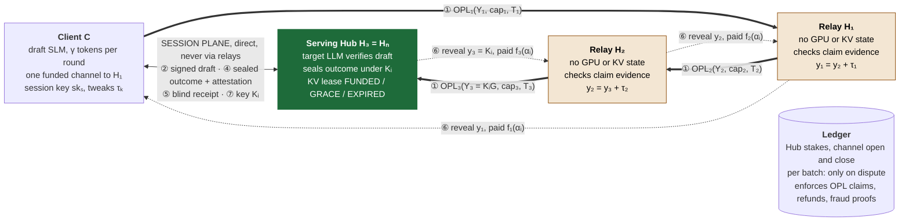
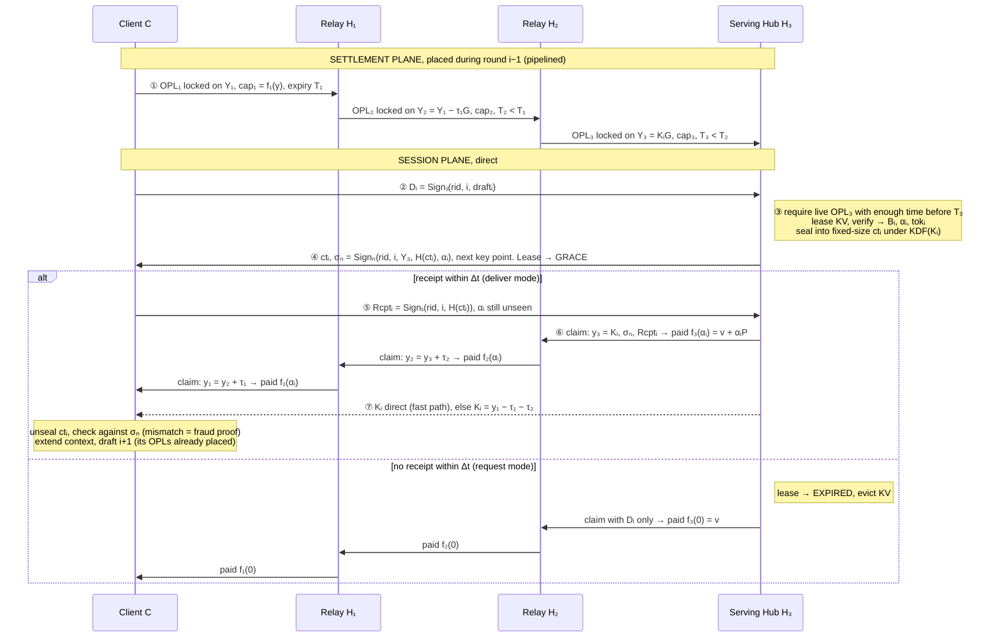

# SpecRoute: Routed Payment Channels for Decentralized Speculative LLM Inference

*Working title and system name. Draft for USENIX Security. Sections are added incrementally.*

<!--
Author notes (not paper text):
- Figures are Mermaid (panel a: architecture and planes; panel b: one round). Redraw in TikZ only at camera-ready.
- Section numbering assumes §1 Introduction and §2 Background (SPECIE, speculative decoding, payment channels).
  Forward references: §4 Threat Model, §5 Protocol, §6 Security Analysis, §7 Collateral Analysis, §8 Evaluation.
- This overview refines design v0.1 (multihop_hub_routing_design.md): sealed outcomes + blind receipts,
  two-mode outcome-priced locks with a request price, and tweaked point locks instead of one shared hash lock.
-->

---

## 3 Overview

SpecRoute lets a client that holds one funded payment channel buy speculative-decoding verification from *any* Hub in the network and pay per accepted token. It needs no trust in the Hubs that relay its payments, and no ledger transaction per session. This section first describes the setting (§3.1) and the properties we want (§3.2). It then explains why routing speculative payments is harder than routing ordinary payments (§3.3), presents the four ideas SpecRoute is built on (§3.4), and walks through one round of the protocol using Figure 1 (§3.5). §4 gives the full threat model, §5 the protocol, and §6 the security analysis.

**(a) Architecture: two planes over one route.**

**(b) One round for batch $i$, including the failure branch.**

**Figure 1: Overview of SpecRoute** on a route $C \to H_1 \to H_2 \to H_3$, for one draft batch $i$. Panel (a) shows who holds what; panel (b) shows the order of messages.

- **Session plane (top).** It carries the inference exchange directly between the client and the serving Hub.
- **Settlement plane (bottom).** It carries only conditional payments, along the route.

The steps of the round:

- **Step ①.** During round $i{-}1$, the client places an *outcome-priced lock* (OPL) for batch $i$ on every link. Each lock uses a different point $Y_k$, derived from the key point $K_i G$ that the serving Hub committed to in advance.
- **Steps ②–⑤.** The client sends a signed draft. The serving Hub verifies it and returns the outcome sealed under $K_i$, with a signed attestation of the accepted count $\alpha_i$. The client acknowledges the ciphertext without seeing $\alpha_i$.
- **Step ⑥.** The serving Hub claims its lock by revealing $K_i$. Each relay turns the revealed secret into its own by adding its tweak $\tau_k$, and claims $f_k(\alpha_i)$ from its upstream neighbour.
- **Step ⑦.** The client obtains $K_i$, either directly or from $y_1$, and unseals the outcome.
- **Failure path (✗).** If no receipt arrives within the grace period $\Delta t$, the serving Hub evicts the session's KV cache and collects only the request price $f_k(0)$.

The ledger is involved in a batch only if there is a dispute.

### 3.1 Setting

**Entities.**

- **Clients** run a small draft model locally, as in SPECIE. Each holds one funded payment channel with a Hub of its choice, its *entry Hub* $H_1$.
- **Hubs** are registered, staked operators with GPU capacity. In a given session a Hub plays one of two roles:
  - the **serving Hub** $H_n$ runs the target model, verifies drafts, and holds the session's KV cache;
  - a **relay** only forwards conditional payments, and holds no GPU or KV state for the session.

  Any Hub can serve some sessions and relay others.
- **Hub-to-Hub channels.** Hubs keep dual-funded channels with one another. These form a *channel graph* whose edges carry directional liquidity.
- **The ledger** is a smart-contract blockchain. It registers Hubs and their stakes, opens and closes channels, and resolves disputes.

A **route** is $\pi = (C, H_1, \dots, H_n)$. Link $\ell_k$ is the channel from $H_{k-1}$ to $H_k$, with $H_0 = C$. When $n = 1$, SpecRoute reduces to a direct session with a single Hub.

**Two planes.** SpecRoute separates the traffic that must be routed from the traffic that need not be.

- The **session plane** is a direct, authenticated connection between the client and the serving Hub. It carries drafts, sealed outcomes, receipts, and keys. It never passes through relays, so relays see no prompt or draft, and they add no latency to inference.
- The **settlement plane** carries only per-batch conditional payments along $\pi$.

A Hub is "unreachable" in our setting when the client has no channel with it, not when there is no network path to it. A client with no network path to $H_n$ can tunnel the session plane through $H_1$, end-to-end encrypted to $H_n$ (§5).

**Sessions.** To start a session, the client:

1. picks a serving Hub;
2. finds a path through the channel graph with enough liquidity;
3. runs a handshake with $H_n$ over the session plane, agreeing the price $P$ per accepted token, the batch size $\gamma$, the request price $v$, and the grace period $\Delta t$;
4. gives each relay its per-hop terms (§5).

Throughout, the client authenticates only with a fresh session key $sk_s$, so no Hub other than $H_1$ learns its on-chain identity. Opening a session requires no ledger transaction. The serving Hub keeps SPECIE's admission cap on concurrent sessions and its lease-based KV scheduler unchanged.

### 3.2 Goals

SpecRoute provides the following properties to every honest party, whatever the other parties on the route do. §6 states them formally.

- **G1 Outcome-atomic payment.** For each batch, the client pays for the verification outcome only once the key that unseals it has been revealed to it. Every link is charged an amount computed from the same outcome, which the serving Hub attests. If the outcome does not match its attestation, the client holds a fraud proof that slashes the serving Hub's stake.
- **G2 Relay balance security.** An honest relay never loses funds. Every payment it makes downstream is matched by a payment of at least the same amount that it can collect upstream. Its only cost is capital locked for a bounded time.
- **G3 Bounded exposure.**
  - An honest client risks at most one request price per request that goes unanswered, and never pays for an outcome it cannot unseal.
  - An honest serving Hub is paid at least the request price for every verification it performs.
- **G4 Abuse costs at least as much as honest use.**
  - Every verification pass and every unit of KV memory an adversary makes an honest serving Hub spend is paid for at the price an honest client pays.
  - The relay capital an adversarial client can lock is bounded in amount by the capital it locks itself, times the path length, and in time by a deadline the serving Hub sets.
- **G5 Native latency.** Assume that payment latency along the path is below the client's drafting time. Then a round's critical path is the same four direct messages as in a direct SPECIE session.

### 3.3 Why Routing Speculative Payments Is Hard

Three natural designs each fail in a way that shapes SpecRoute.

**Strawman 1: open a channel to every Hub.** Every new Hub costs two ledger transactions and a minimum deposit. For short inference sessions, which are the common case, this fixed cost dominates the cost of the inference itself. This is the cost SpecRoute exists to remove.

**Strawman 2: route a Lightning-style HTLC.** Multi-hop hash time-locked contracts route an amount that is fixed *before* the payment is locked. Here the amount $\alpha_i P$ is known only *after* the serving Hub has verified the batch. One workaround is to lock the maximum, $\gamma P$, and refund the difference. That needs a second, reverse payment through every hop for every batch, which costs one path round trip and a second set of locks per batch. A hash lock also has a deeper problem: it releases payment in exchange for a preimage, and a preimage says nothing about whether the client received the verification result it paid for.

**Strawman 3: forward SPECIE's payment envelope hop by hop.** In SPECIE, the client receives the acceptance bitmap $B_i$ in the clear and then pays. Over a direct channel this is safe: a client that takes a bitmap and walks away loses its channel, and must pay the ledger to open a new one. Over a route, sessions cost nothing to open. A client can therefore take one bitmap per session, never pay, and repeat indefinitely. In speculative decoding the bitmap *is* the service, because the client already holds the drafted tokens the bitmap certifies. The same lack of per-session cost lets one deposit back any number of sessions, each holding KV memory at the serving Hub. That is exactly the exhaustion SPECIE's minimum deposit was there to prevent.

These failures expose four challenges:

- **C1 Amounts bound late.** The amount is fixed only after the work is done, yet every hop must agree on it without an extra round trip.
- **C2 Fair exchange of information across untrusted intermediaries.** What the client buys is information whose value is realized the moment it is seen. One party delivers it, while the payment passes through several others.
- **C3 Pricing abuse without per-session deposits.** Routing removes the ledger-level cost that deterred free-riding and resource exhaustion in SPECIE.
- **C4 Costs that grow with path length.** Each hop can add latency to every round, and each hop locks its own capital for every batch in flight.

### 3.4 Key Ideas

**Idea 1: Sealed outcomes whose key is the payment secret (C2).** The serving Hub returns the verification outcome (the bitmap $B_i$ and the correction token) encrypted under a fresh key $K_i$. Every lock on the route is released by a secret from which $K_i$ can be computed. Two consequences follow:

- The client acknowledges the ciphertext before it can read it, so there is nothing it can take before committing to pay.
- The serving Hub cannot collect any payment without revealing $K_i$, so it cannot take payment and withhold delivery. Payment and delivery become the same event, and SPECIE's separate key-withholding dispute is no longer needed.

The price of this is that the client no longer inspects $B_i$ before paying. In SPECIE that inspection could only check the bitmap's *form*, because the client does not hold the target model. SpecRoute keeps that check and makes it binding: an outcome that is inconsistent with the serving Hub's signed attestation is a fraud proof on the ledger.

**Idea 2: Outcome-priced locks (C1, C3).** On each link, each batch is paid through an *outcome-priced lock* (OPL). An OPL is a capped conditional payment whose amount is a public function $f_k$ of the outcome. The same evidence is bound from both ends:

- the serving Hub commits to the outcome in a signed attestation $\sigma_n$, which binds the accepted count $\alpha_i$ to the hash of the ciphertext;
- the client's blind receipt binds the same hash.

Every hop, and the ledger in a dispute, evaluates the same predicate on the same evidence and computes the same $f_k(\alpha_i)$. No hop renegotiates, and no refund travels back. An OPL has two claim modes, and only one can ever be used:

- **Deliver mode** pays $f_k(\alpha_i)$ against the secret, the attestation, and the receipt.
- **Request mode** pays $f_k(0)$ against the client's signed draft request alone. Here $f_k(0)$ is the request price $v$ plus relay fees. $v = v(D_i)$ is a public function of the signed request; for example, it grows with prompt length on a session's first batch. It covers the serving Hub's marginal cost of one verification pass plus the KV memory the session holds until its next batch is due. A session that sends no further draft by then is evicted, so a large request cannot cost the Hub more than it pays.

A client that sends drafts but never acknowledges results therefore pays for exactly the resources it consumed. Holding a KV cache requires sending drafts, and every draft is paid for. This replaces SPECIE's per-channel deposit with a per-request price, and a per-request price still works when sessions are free.

**Idea 3: Relay-bound lock secrets (C2, for relays).** SpecRoute does not lock every hop on the same hash. It locks link $\ell_k$ on a point $Y_k = Y_{k+1} + \tau_k G$ in a prime-order group, where:

- $Y_n = K_i G$ is committed in advance by the serving Hub;
- $\tau_k$ is a random tweak that the client gives only to relay $H_k$.

A relay turns the downstream secret into its own by adding $\tau_k$. Each relay's claim is therefore bound to a value only that relay can compute. Two colluding relays cannot skip the honest relay between them and take its fee (the *wormhole* attack on hash-locked routes), and the ledger checks each claim with one scalar multiplication. We use point locks for this binding, not for route privacy: relays verify endpoint-signed evidence and can therefore link the hops of a route (§4).

**Idea 4: Pipelined locks and lease-coupled unwinding (C4).** This idea addresses latency and collateral separately.

- **Latency.** Each response from the serving Hub includes the key point for the next batch. The client can therefore place batch $i$'s locks during round $i{-}1$, while it is still drafting. Locks travel in parallel with inference rather than ahead of it, and each round keeps SPECIE's four direct messages on its critical path.
- **Collateral.** The serving Hub ties the resolution of each lock to the lease state machine SPECIE already runs for its KV cache. When a session's lease expires, the Hub collects the request price for the outstanding batch and cancels unused pre-placed locks, so the route clears at once. A client therefore cannot keep relay capital locked for longer than a deadline the serving Hub sets.

Only a *Hub* that stops responding can hold capital until the ledger expiries $T_1 > \dots > T_n$. The gaps between these expiries are set by the ledger's finality bound $D_{L1}$, which is seconds on the fast-finality ledger our prototype uses. §7 shows that locked collateral grows linearly with path length for honest traffic and quadratically under stalling, and quantifies both.

### 3.5 One Round, End to End

We follow batch $i$ through Figure 1.

- **① Lock (during round $i{-}1$).** The client receives the key point $K_i G$ for batch $i$. It computes the points $Y_k$ and offers $\mathrm{OPL}_1$ to $H_1$, with cap $f_1(\gamma)$ and expiry $T_1$. Each relay checks its terms before forwarding $\mathrm{OPL}_{k+1}$:
  - its fee;
  - that its tweak is consistent, i.e. $Y_k = Y_{k+1} + \tau_k G$;
  - that the expiry gap is at least $D_{L1}$ plus a margin;
  - that the cap covers the downstream cap plus its fee.

  Once offered, a lock cannot be withdrawn by its sender before its expiry; only the receiver can release it early. The client never places two locks for the same $(\mathit{rid}, i)$; a lock that is replaced gets a fresh identifier. The serving Hub accepts a draft only if its incoming lock is in place and has enough time left before $T_n$ to settle on the ledger.
- **② Draft.** The client drafts $\gamma$ tokens and sends the signed request $D_i = \mathrm{Sign}_{s}(\mathit{rid}, i, \mathit{draft}_i)$ to $H_n$.
- **③ Verify and seal.** $H_n$ leases KV blocks for the batch. It runs one forward pass, which yields the bitmap $B_i$, the accepted count $\alpha_i$, and the correction token. It encrypts $B_i$ and the correction token under a key derived from $K_i$, padded to a fixed size so that the ciphertext's length does not reveal $\alpha_i$. Verification is a single forward pass over all $\gamma$ tokens, so the response's timing does not reveal $\alpha_i$ either.
- **④ Attest.** $H_n$ returns three things: the ciphertext $ct_i$; the attestation $\sigma_n = \mathrm{Sign}_{n}(\mathit{rid}, i, Y_n, H(ct_i), \alpha_i)$; and the key point for batch $i{+}w$. The lease enters GRACE.
- **⑤ Blind receipt.** The client returns $\mathrm{Rcpt}_i = \mathrm{Sign}_{s}(\mathit{rid}, i, H(ct_i))$. Up to this point it has learned nothing about $\alpha_i$.
- **⑥ Claim.** $H_n$ claims $\mathrm{OPL}_n$ in deliver mode. It reveals $y_n = K_i$ together with $\sigma_n$ and $\mathrm{Rcpt}_i$, and receives $f_n(\alpha_i) = v + \alpha_i P$. Each relay $H_k$ checks the same evidence, computes $y_k = y_{k+1} + \tau_k$, and claims $f_k(\alpha_i)$ from $H_{k-1}$. The last claim is $H_1$'s claim on the client. Each claim is an off-chain update between neighbours; the ledger sees it only if a neighbour stops cooperating.
- **⑦ Unseal.** $H_n$ also sends $K_i$ directly to the client, as a fast path. The client can instead compute $K_i = y_1 - \sum_k \tau_k$ from the secret $H_1$ reveals when it claims, so it never pays without being able to decrypt. The client then:
  1. decrypts $ct_i$;
  2. checks the outcome against $\sigma_n$ (a mismatch is a fraud proof);
  3. extends its context with the accepted prefix and the correction token;
  4. drafts batch $i{+}1$, whose locks are already in place.

**When things go wrong.**

- **The client never acknowledges.** If no receipt arrives within $\Delta t$, $H_n$'s lease expires. $H_n$ evicts the session's KV blocks as in SPECIE and claims request mode with $D_i$, and the relays pass that claim upstream.
- **The serving Hub never answers.** The client stops drafting, having lost at most $f_1(0)$.
- **Any party goes silent.** Its neighbour settles on the ledger before the relevant expiry. The expiry ladder guarantees that an honest relay that has paid downstream can always collect upstream (§6).

### 3.6 Assumptions and Scope

SpecRoute relies on standard assumptions, detailed in §4:

- **Cryptography.** Existentially unforgeable signatures, collision-resistant hashing, hardness of discrete logarithms in the lock group $\mathbb{G}$, and authenticated encryption.
- **Ledger.** The ledger is safe, executes contracts as specified, and includes any party's transaction within a known bound $D_{L1}$.
- **Network.** Peer-to-peer messages may be delayed arbitrarily. None of SpecRoute's safety properties depend on their timing; only liveness does.
- **Monitoring.** As in any payment-channel network, each honest party checks the ledger at least once per expiry gap, either directly or through a watchtower.
- **Adversary.** It may corrupt any set of clients and Hubs and make them deviate arbitrarily. It cannot corrupt the ledger.
- **Stake.** A client detects a mismatched outcome as soon as it unseals it, and it cannot draft the next batch before doing so. A serving Hub can therefore overcharge each concurrent session at most once before being caught. Its stake is required to cover $N_{\max}$ such overcharges, one per concurrent session it admits.

We also state what SpecRoute does *not* provide, so that §3.2 is not overread:

- **Correctness of inference.** SpecRoute guarantees that the client pays for exactly the outcome the serving Hub attested and that the client can decrypt. It does not guarantee that the target model produced that outcome. A Hub that returns a well-formed but wrong outcome is deterred economically, as in SPECIE. This question is orthogonal to routing: a proof of inference bound into $\sigma_n$ would compose with SpecRoute unchanged.
- **Confidentiality from the serving Hub.** $H_n$ sees the prompt and drafts, as in any inference service. Relays see neither.
- **Route privacy.** Relays learn $\alpha_i$ when they check a claim, and they can link the hops of one route through the endpoint signatures. SpecRoute hides the client's on-chain identity from every Hub except $H_1$. It does not hide the fact that a route exists.
- **Prevention of jamming by a stalling Hub.** A Hub that accepts a lock and then goes silent holds the capital upstream of it until the ledger expiries. The same is true of every network of hash- or point-time-locked contracts. SpecRoute bounds this rather than preventing it. A stall earns the staller nothing, is visible to its neighbour, and holds capital for seconds on a fast-finality ledger. §7 quantifies the worst case.
- **Network-level denial of service** such as link flooding. This is an infrastructure concern, not a protocol one.
